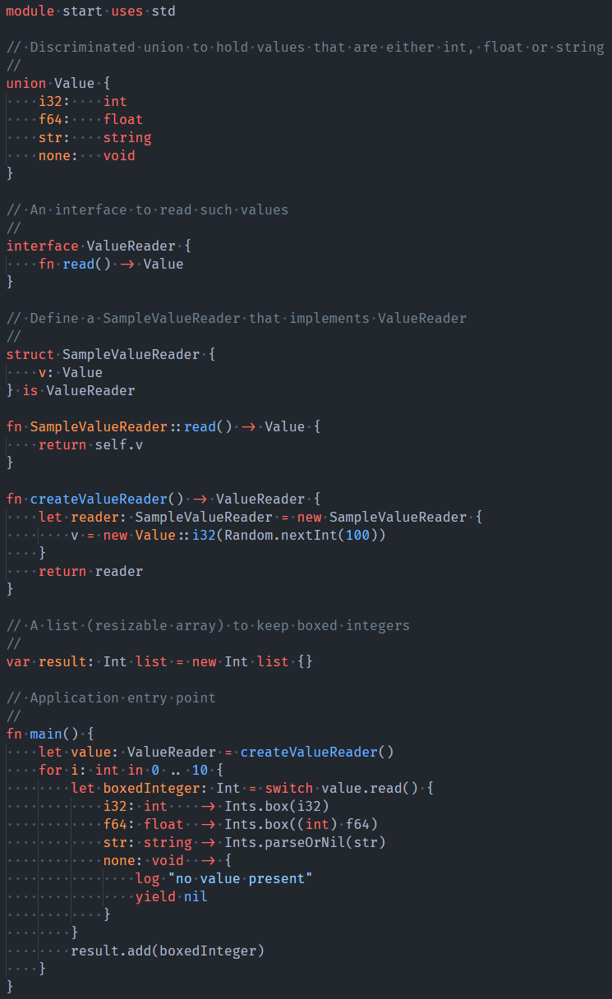

# zlang

A statically typed, embeddable scripting language

Feature:
- Tiny, embeddable virtual machine written in C
- Java compiler that produces `.zap` file that can be run by the VM
- Support for interfaces, structs and discriminated unions
- Primitive types: `int` (32 bit), `float` (64 bit), `byte` (8 bit unsigned), `bool` and `string`
- Reference counting and automatic cleanup for dynamically allocated objects
- Constants (`let`) and variables (`var`), local and global
- Information hiding through modules: struct fields and global variables are only visible in the defining module
- Each file is a module
- Syntax inspired by Go, Rust and Swift
